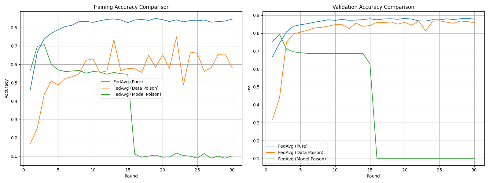
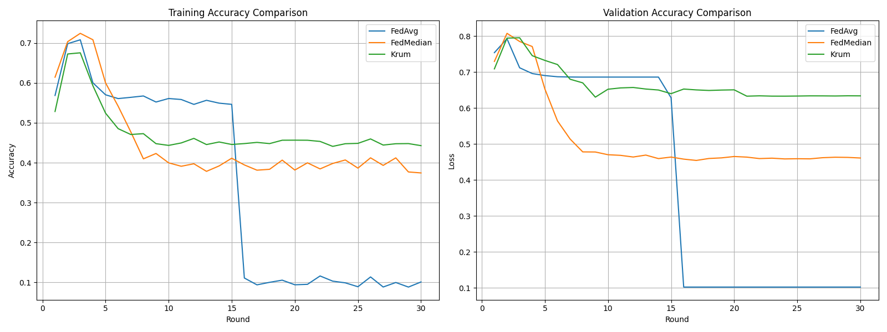
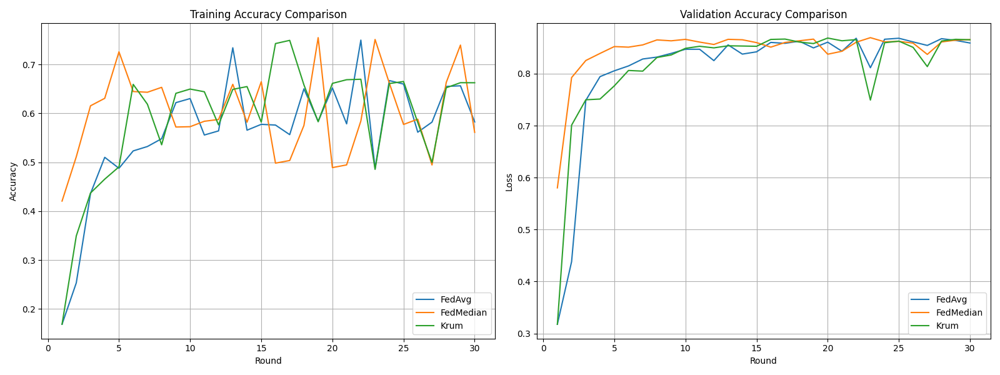

# 📦 Federated Learning Implementation (FedAvg, FedMedian, Krum)

## 📌 Strategy Overview

This project implements **Federated Averaging (FedAvg)** as the baseline algorithm, extended with robust aggregation methods **FedMedian** and **Krum** to counter adversarial attacks. The strategies are configurable within a single branch:

- **FedAvg**: Trains models locally, averages weights from sampled clients, and repeats over rounds.
- **FedMedian**: Uses coordinate-wise median to mitigate malicious updates.
- **FedKrum**: Selects the most representative update based on distance metrics to resist Byzantine attacks.

This implementation also simulates **data poisoning** and **model poisoning** attacks to evaluate security.

### 🧮 Key Equations

- **FedAvg**: **w<sub>t+1</sub> = (1/K) * Σ [k=1 to K] w<sub>t</sub><sup>(k)</sup>**
  - **K**: Number of sampled clients
  - **w<sub>t</sub><sup>(k)</sup>**: Model weights from client **k** at round **t**

- **FedMedian**: **w<sub>median</sub>(i) = median(w<sub>1</sub>(i), w<sub>2</sub>(i), ..., w<sub>K</sub>(i))**
  - Coordinate-wise median of client updates

- **Krum**: Selects update with lowest score based on sum of distances to **n-f-2** closest neighbors
  - **n**: Total clients, **f**: Expected malicious clients

---

## 🔍 Core Implementation

### 🔑 Key Files

| File          | Role                          | Code Reference                     |
|---------------|-------------------------------|------------------------------------|
| `strategy.py` | Aggregation logic (FedAvg, FedMedian, Krum) | [`src/strategy.py`](src/strategy.py) |
| `client.py`   | Local training with attack logic | [`src/client.py`](src/client.py)    |

### 🛠️ Key Snippet (FedAvg Aggregation)

```python
# In strategy.py
def aggregate_fit(
        self,
        server_round: int,
        results: List[Tuple[ClientProxy, FitRes]],
        failures: List[Union[Tuple[ClientProxy, FitRes], BaseException]]
    ) -> Tuple[Optional[Parameters], Dict[str, Scalar]]:
        if not results:
            return None, {}

        weights = []
        num_examples = []
        
        for _, fit_res in results:
            ndarrays = parameters_to_ndarrays(fit_res.parameters)
            weights.append(ndarrays)
            num_examples.append(fit_res.num_examples)

        total_examples = sum(num_examples)
        averaged_weights = [
            sum(w[i] * n for w, n in zip(weights, num_examples)) / total_examples
            for i in range(len(weights[0]))
        ]
        
        avg_loss = np.mean([res.metrics["train_loss"] for _, res in results])
        avg_acc = np.mean([res.metrics["train_accuracy"] for _, res in results])

        return ndarrays_to_parameters(averaged_weights), {
            "train_loss": float(avg_loss),
            "train_accuracy": float(avg_acc)
        }
```

### 🛠️ Key Snippet (Data Poisoning)

```python
# In client.py
def _data_poisoning(self, target: torch.Tensor) -> torch.Tensor:
        """Implement label flipping attack"""
        # Flip labels for a portion of the data
        mask = torch.rand(len(target)) < self.poison_ratio
        poisoned_target = target.clone()
        poisoned_target[mask] = 9 - poisoned_target[mask]  # Flip to complementary class
        return poisoned_target
```

### 🛠️ Key Snippet (Model Poisoning)

```python
# In client.py
def _model_poisoning(self, parameters: List[np.ndarray]) -> List[np.ndarray]:
        """Implement model poisoning by scaling updates"""
        # Scale up the parameters to dominate aggregation
        poisoned_parameters = [param * 3.0 for param in parameters]  # Scale by 3
        return poisoned_parameters

```

### 🛠️ Key Snippet (FedMedian Aggregation)

```python
# In strategy.py
def aggregate_fit(self, server_round, results, failures):
        if not results:
            return None, {}

        weights = [parameters_to_ndarrays(fit_res.parameters) for _, fit_res in results]
        
        # Add parameter clipping
        clipped_weights = []
        for client_weights in weights:
            clipped = [
                np.clip(w, -self.robust_scale, self.robust_scale) 
                for w in client_weights
            ]
            clipped_weights.append(clipped)
        
        # Compute coordinate-wise median
        median_weights = [
            np.median(np.stack([w[i] for w in clipped_weights]), axis=0)
            for i in range(len(clipped_weights[0]))
        ]
        
        # Compute metrics
        avg_loss = np.mean([res.metrics["train_loss"] for _, res in results])
        avg_acc = np.mean([res.metrics["train_accuracy"] for _, res in results])

        return ndarrays_to_parameters(median_weights), {
            "train_loss": float(avg_loss),
            "train_accuracy": float(avg_acc)
        }
```

### 🛠️ Key Snippet (Krum Aggregation)

```python
# In strategy.py
def aggregate_fit(
        self,
        server_round: int,
        results: List[Tuple[ClientProxy, FitRes]],
        failures: List[BaseException],
    ) -> Tuple[Optional[Parameters], Dict[str, Scalar]]:
        if not results:
            return None, {}

        # Convert to list of model weights (list of list of np.ndarray)
        weights = [parameters_to_ndarrays(res.parameters) for _, res in results]

        # Flatten weights into 1D vectors for distance comparison
        flattened_updates = [np.concatenate([w.flatten() for w in weight]) for weight in weights]
        updates_array = np.stack(flattened_updates)

        # Krum selection
        selected_idx = self._compute_krum_score(updates_array)
        selected_weights = weights[selected_idx]

        # Robust metric aggregation with fallback
        losses = [res.metrics.get("train_loss", 0.0) for _, res in results]
        accs = [res.metrics.get("train_accuracy", 0.0) for _, res in results]
        avg_loss = float(np.mean(losses))
        avg_acc = float(np.mean(accs))

        return ndarrays_to_parameters(selected_weights), {
            "train_loss": avg_loss,
            "train_accuracy": avg_acc,
        }
```

---

## 📊 Performance Summary

### FedAvg variants (α = 10, FedAvg)

| Ratio | Train Acc | Val Acc | Train Loss | Val Loss |
|-------|-----------|---------|------------|----------|
| 0%    | 0.87      | 0.84    | 0.47       | 0.35     |
| 25%   | 0.73      | 0.86    | 0.70       | 0.49     |
| 50%   | 0.58      | 0.85    | 0.92       | 0.75     |

### By Aggregation Method & Data poison(α = 10, 50% Malicious clients)

| Method  | Train Acc | Val Acc | Train Loss | Val Loss |
|---------|-----------|---------|------------|----------|
| FedAvg  | 0.58      | 0.85    | 0.92       | 0.75     |
| FedMedian | 0.56    | 0.86    | 1.02       | 0.56     |
| Krum    | 0.66      | 0.86    | 0.81       | 0.47     |


### By Aggregation Method & Model poison(α = 10, 50% Malicious clients) and 10 times shift

| Method  | Train Acc | Val Acc | Train Loss | Val Loss |
|---------|-----------|---------|------------|----------|
| FedAvg  | 0.10      | 0.10    | Nan       | Nan     |
| FedMedian | 0.37    | 0.46    | 6.42      | 3.9     |
| Krum    | 044      | 0.63    | 6.68       | 1.9     |

*Note: Results are approximate due to limited rounds (30) and sampling (5/10 clients).*

---

# Training Dynamics Analysis

## 📈 Training and Validation Accuracy Comparison

### Images Provided


- FedAvg performance decreases as there is a client who is poisonous is increased. the above graph shows FedAvg with different state. the poisoned clients are the 50% of the total clients done manually while running clients.




- The above graph is Model Poisoning
-We can notice that all Strategies performs low due to the poisonous of the 50% clients. but even though we can notice that FedAvg performs the worest.




- The above graph shows the same for Data poisioning.


### 💡 Key Observations
1. **No Malicious Clients (0%)**: All methods perform reliably, with FedAvg showing the highest stability.
2. **Moderate Malicious Ratio (25%)**: Data poisoning moderately degrades FedAvg; FedMedian and Krum likely outperform by reducing malicious effects.
3. **High Malicious Ratio (50%)**: FedAvg becomes unstable with both attack types; FedMedian remains robust.


---

## ⚠️ Limitations

- **Time Constraint**: Academic schedules limited development time, leading to compromises.
- **Limited Rounds**: Only 30 rounds were used, insufficient for full convergence, especially under attacks.
- **Sampling Constraint**: Only 5 out of 10 clients were sampled, potentially skewing aggregation.
- **Last-Time Errors**: Model poisoning implementation faced unresolved errors, limiting its effectiveness.
- **Unexpected Results**: Some trainings did not meet expectations due to these constraints, affecting reliability.

---

## 🛠️ How to Run

```bash
# Generate client data
python main.py generate-data --num-clients 10 --alpha 10
```

```bash
# Run a client (e.g., healthy or malicious)
python main.py run-client --cid=0 --attack_type=none &
python main.py run-client --cid=1 --attack_type=data &
```

```bash
# Run server with desired strategy
python main.py run-server --rounds 30 --strategy fedavg --output results.json
python main.py run-server --rounds 30 --strategy fedmedian --output results.json
python main.py run-server --rounds 30 --strategy krum --output results.json
```

```bash
# Run simulation with configurable options
python main.py simulate --num-clients 10 --rounds 30 --strategy fedavg --malicious_ratio 0.25 --output results_alpha_10.json
```

---

## 📝 Conclusion
- **Truth**: FedAvg is highly vulnerable to data and model poisoning, especially at 50% malicious clients, with accuracy dropping sharply. FedMedian consistently outperforms FedAvg, maintaining stability, while Krum's effectiveness is unclear due to limited data. The 30-round limit and sampling (5/10 clients) contribute to suboptimal results. 

